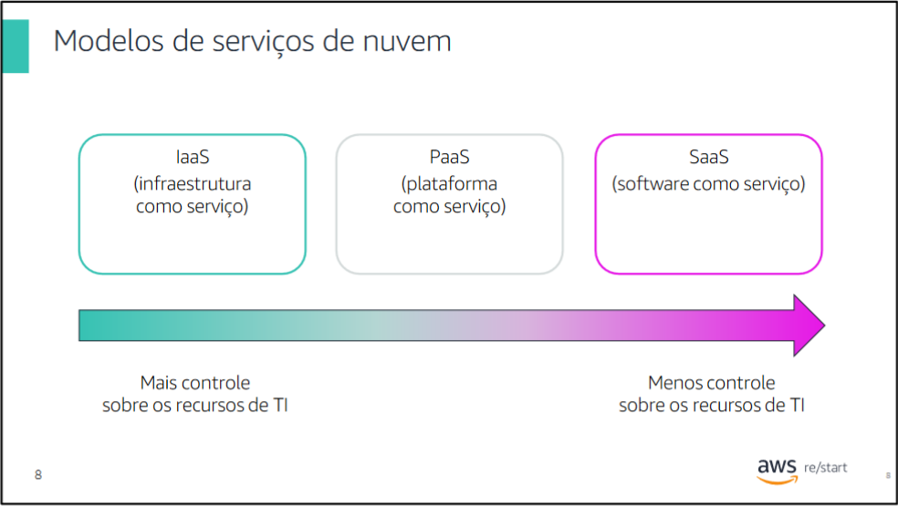
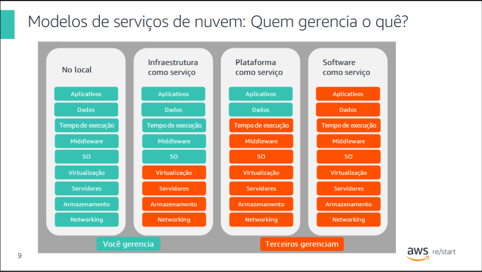
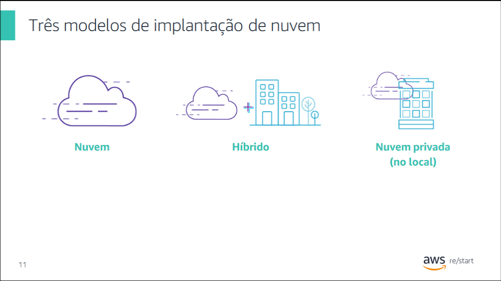

# O que é Computação em Nuvem?

Computação em nuvem é a entrega sob demanda de capacidade de computação, banco de dados, armazenamento, aplicativos e outros recursos de TI. Esses recursos são entregues por meio de uma plataforma de serviços de nuvem via Internet, compagamento conforme o uso.

Na definição mais básica, nuvem é um computador localizado em algum outro lugar, acessado pela Internet e utilizado de alguma forma. Serviços web é outro nome pelo qual as pessoas chamam a nuvem.

A nuvem é composta por computadores servidores em grandes data centers em diferentes locais ao redor do mundo. Ao usar um serviço de nuvem, como a Amazon Web Services (AWS), você usa os computadores de propriedade da AWS.

Os computadores contêm vários recursos e serviços de tecnologia, que são como componentes básicos que podem ser usados para montar soluções. Essas soluções ajudam os usuários a cumprir suas metas de negócios e requisitos de tecnologia. Com a computação em nuvem, as organizações podem consumir recursos de computação e de armazenamento sob demanda, em vez de construir, operar e melhorar a infraestrutura sozinhos.

# Modelo Tradicional

## Infraestrutura como hardware

- As soluções de hardware são físicas e exigem:
  - Espaço
  - Equipe
  - Segurança física
  - Planejamento
  - Despesas de capital

- Você precisa adivinhar os picos máximos teóricos:
  - Há capacidade de recursos suficiente?
  - Você tem armazenamento suficiente?

- E se as necessidades mudarem?
  - Você precisa dedicar tempo, esforço e custo necessários para fazer todas essas alterações.

## Infraestrutura como software

- A computação em nuvem permite parar de pensar na infraestrutura como hardware e pensar (e usar) como software.

- Se as necessidades mudarem, o software poderá mudar de forma muito mais rápida, fácil e econômica do que o hardware.

# Modelos de Serviço em Nuvem

    

## Principais Modelos de Serviço em Nuvem

- IaaS (infraestrutura como serviço)
- PaaS (plataforma como serviço)
- SaaS (software como serviço)

Os serviços de nuvem podem se enquadrar em uma de três categorias principais, baseadas principalmente no controle e responsabilidade sobre a forma como o serviço é configurado.

Com a infraestrutura como serviço (IaaS), você gerencia o servidor, que pode ser físico ou virtual, e o sistema operacional (Microsoft Windows ou Linux). Em geral, o provedor de data center não tem acesso ao seu servidor.

Com a plataforma como serviço (PaaS), um terceiro gerencia o hardware e os sistemas operacionais subjacentes. Dessa forma, é possível executar aplicativos sem gerenciar a infraestrutura subjacente (por exemplo, aplicação de patches, atualizações, manutenção, hardware e sistemas operacionais). O PaaS também oferece uma estrutura para desenvolvedores que pode ser usada na construção de aplicativos personalizados.

Com o software como serviço (SaaS), você gerencia seus arquivos enquanto o provedor de serviços gerencia todos os data centers, os servidores, as redes, o armazenamento, a manutenção e a aplicação de patches. Você é responsável apenas pelo software e como quer usá-lo. Você recebe um produto completo, executado e gerenciado pelo provedor de serviços. O Facebook e o Dropbox são exemplos de SaaS. Você gerencia seus contatos do Facebook e os arquivos do Dropbox, e os provedores de serviços gerenciam os sistemas.

    

# Modelos de Implantação

    

Os três principais modelos de implantação de computação em nuvem representam os ambientes de nuvem nos quais é possível implantar aplicativos.

- **Nuvem (ou tudo na nuvem):**
  Um aplicativo baseado na nuvem totalmente implantado na nuvem. Todas as partes do aplicativo são executadas na nuvem. Os aplicativos na nuvem foram criados na nuvem ou migrados de uma infraestrutura existente. Os aplicativos baseados na nuvem podem ser construídos em partes da infraestrutura de baixo nível (por exemplo, rede, computação ou armazenamento) ou podem usar serviços de nível superior que oferecem abstração dos requisitos de gerenciamento, arquitetura e dimensionamento da infraestrutura principal.
  
- **Implantação híbrida:**
  Uma maneira de conectar infraestrutura e aplicativos entre recursos baseados na nuvem e recursos existentes fora da nuvem. O método mais comum de implantação híbrida é entre a nuvem e a infraestrutura local existente. A infraestrutura local está localizada nos limites físicos de uma empresa, geralmente no data center. Um modelo de implantação híbrida é usado para estender a infraestrutura de uma organização para a nuvem, ao mesmo tempo em que conecta os recursos da nuvem a um sistema interno.

- **Nuvem Local (ou Nuvem Privada):**
  Ao executar uma infraestrutura de nuvem em seu próprio data center, ela é chamada de nuvem local (ou nuvem privada). Embora esse tipo de implantação não ofereça muitos dos benefícios da computação em nuvem, ela oferece recursos dedicados. É uma opção popular para as organizações que precisam atender a determinados padrões de conformidade. Na maioria dos casos, esse modelo de implantação é igual à infraestrutura de TI herdada, mas usa gerenciamento e virtualização de aplicativos a fim de aumentar a utilização dos recursos.

## Resumindo as Diferenças

- Com a solução de nuvem, não há investimento inicial. Portanto, é possível evitar as grandes despesas de capital necessárias para uma solução local. Você tem acesso imediato aos recursos. Não é necessário adquirir, instalar e configurar hardware em um local físico que tenha instalações apropriadas, como refrigeração e energia. Em vez disso, cabos, racks, servidores e armazenamento são fornecidos remotamente. Você clica para fazer o pedido e paga pelos recursos de que precisa, que são disponibilizados quase imediatamente.
  
- A computação em nuvem ajuda a reduzir os custos contínuos de TI de várias maneiras. A AWS reduz continuamente os preços devido a grandes econom

ias de escala e melhorias contínuas. As várias opções de preços também ajudam a otimizar os custos com base nas cargas de trabalho exclusivas. Você paga apenas pelo que usa mensalmente, de maneira variável. As soluções locais normalmente exigem atualizações em ciclos de um, três ou cinco anos.

- A computação em nuvem também pode oferecer recursos de TI gerenciados sob demanda, por uma fração do custo da infraestrutura tradicional. Essa redução de custos permite que as organizações orientem os recursos para novos projetos inovadores que expandem seus negócios ao se concentrarem nos aplicativos, não nas operações.

- A previsão de como os clientes adotarão o novo aplicativo é um processo complexo, o que dificulta a estimativa das necessidades de capacidade de infraestrutura. Capacidade flexível significa que os recursos são dinâmicos. É possível provisionar recursos rapidamente à medida que a demanda aumenta e remover os desnecessários à medida que a demanda diminui.

- A velocidade e a agilidade da computação em nuvem possibilitam responder às condições de mercado em constante evolução. Com a AWS, os recursos podem ser provisionados conforme a necessidade. Esse ambiente de autoatendimento altera a maneira como você desenvolve e implanta aplicativos, permitindo que sua equipe experimente de maneira mais rápida e mais frequente. O tempo necessário para adquirir, entregar e executar um servidor se torna caro em uma infraestrutura tradicional.

- Com a infraestrutura local, é difícil oferecer um ótimo desempenho a uma base de usuários distribuída. As despesas iniciais são grandes. Também exige muita mão de obra e patches, ciclos de atualização e administração de sistemas com capacidade fixa. Os longos ciclos de aquisição e configuração fazem com que as empresas se concentrem em uma região geográfica para economizar custos e tempo. Sem limitações geográficas, é possível implantar o aplicativo em qualquer Região da AWS ao redor do mundo, com menor latência e por um custo mínimo.

--- 

Espero que essa formatação deixe o README mais legível e organizado!